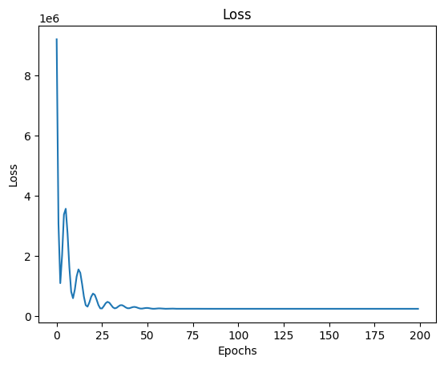

# Visualization of Linear Regression

The following code demonstrates how a machine learning algorithm utilizes gradient descent to find the regression curve $y=ax+b$.


By observing the graph, we can discern the distinct behaviors in both the feature domain and the real domain.

- In the real domain, the regression curve $y=ax+b$ is depicted, showcasing its diligent effort to fit the data points.
- In the feature domain, we can observe the impact of the gradient on the two variables, $a$ and $b$.

The mean squared error (MSE) loss function and Adam optimizer are employed, with a learning rate set to 50. This learning rate may seem high, resulting in some oscillations. Don't ask me why not to turn it down. It looks very cool!


### Requirements
```
matplotlib==3.7.1
numpy==1.23.4
```